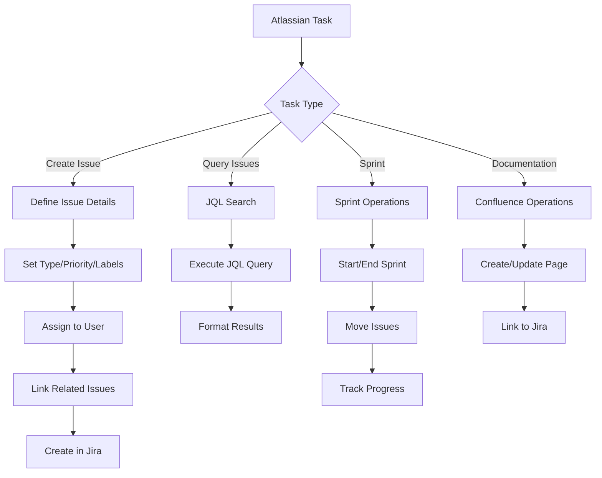

# Workflow

## Integration Flow
1. PR created → Jira issue transitioned to "In Review"
2. PR merged → Jira issue transitioned to "Done"
3. Release → Confluence release notes page updated
4. Sprint end → Sprint report generated
