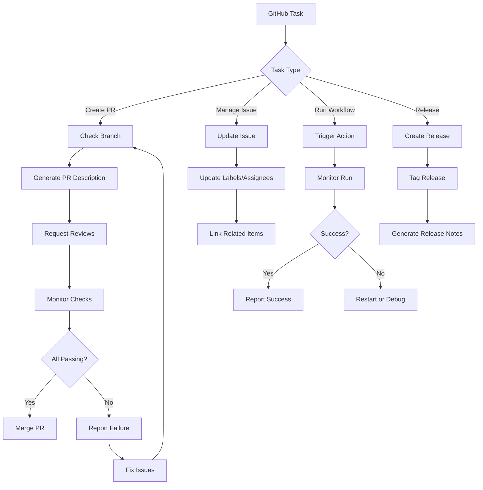

# Workflow

```mermaid
flowchart TD
    A[GitHub Task] --> B{Task Type}
    B -->|Create PR| C[Check Branch]
    B -->|Manage Issue| D[Update Issue]
    B -->|Run Workflow| E[Trigger Action]
    B -->|Release| F[Create Release]
    C --> G[Generate PR Description]
    G --> H[Request Reviews]
    H --> I[Monitor Checks]
    I --> J{All Passing?}
    J -->|Yes| K[Merge PR]
    J -->|No| L[Report Failure]
    L --> M[Fix Issues]
    M --> C
    D --> N[Update Labels/Assignees]
    N --> O[Link Related Items]
    E --> P[Monitor Run]
    P --> Q{Success?}
    Q -->|Yes| R[Report Success]
    Q -->|No| S[Restart or Debug]
    F --> T[Tag Release]
    T --> U[Generate Release Notes]
```

## Integration Points
- PR lifecycle management
- Issue tracking and updates
- CI/CD workflow orchestration
- Release and tag management
