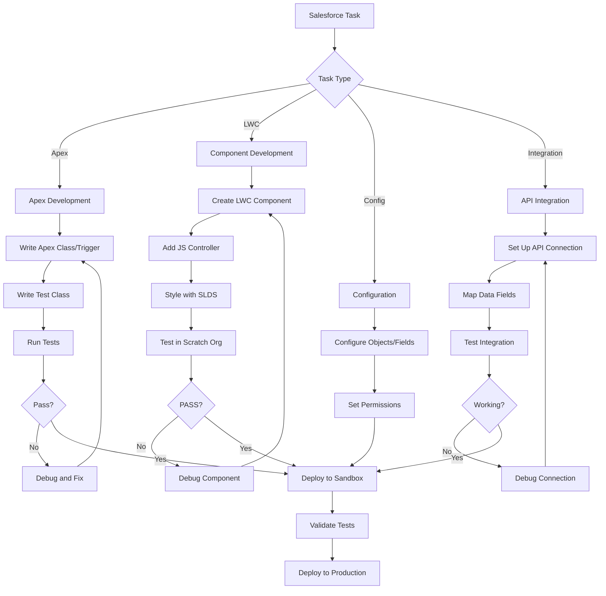

# Workflow

```mermaid
flowchart TD
    A[Salesforce Task] --> B{Task Type}
    B -->|Apex| C[Apex Development]
    B -->|LWC| D[Component Development]
    B -->|Config| E[Configuration]
    B -->|Integration| F[API Integration]
    C --> G[Write Apex Class/Trigger]
    G --> H[Write Test Class]
    H --> I[Run Tests]
    I --> J{Pass?}
    J -->|No| K[Debug and Fix]
    K --> G
    J -->|Yes| L[Deploy to Sandbox]
    D --> M[Create LWC Component]
    M --> N[Add JS Controller]
    N --> O[Style with SLDS]
    O --> P[Test in Scratch Org]
    P --> Q{PASS?}
    Q -->|No| R[Debug Component]
    R --> M
    Q -->|Yes| L
    E --> S[Configure Objects/Fields]
    S --> T[Set Permissions]
    T --> L
    F --> U[Set Up API Connection]
    U --> V[Map Data Fields]
    V --> W[Test Integration]
    W --> X{Working?}
    X -->|No| Y[Debug Connection]
    Y --> U
    X -->|Yes| L
    L --> Z[Validate Tests]
    Z --> AA[Deploy to Production]
```

## Phases
1. Development: code, components, configuration
2. Testing: unit tests, sandbox validation
3. Deployment: metadata deployment
4. Verification: post-deployment testing
