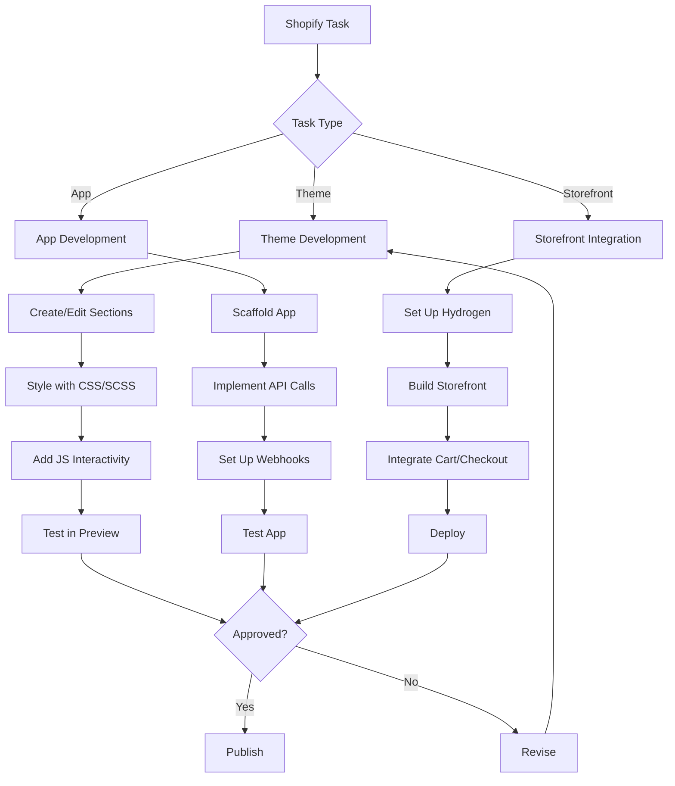

# Workflow

## Development Phases
1. Planning: requirements, design, data model
2. Development: theme/app/storefront code
3. Testing: preview, cross-browser, e2e
4. Deployment: publish theme, deploy app
5. Monitoring: performance, errors, sales impact
