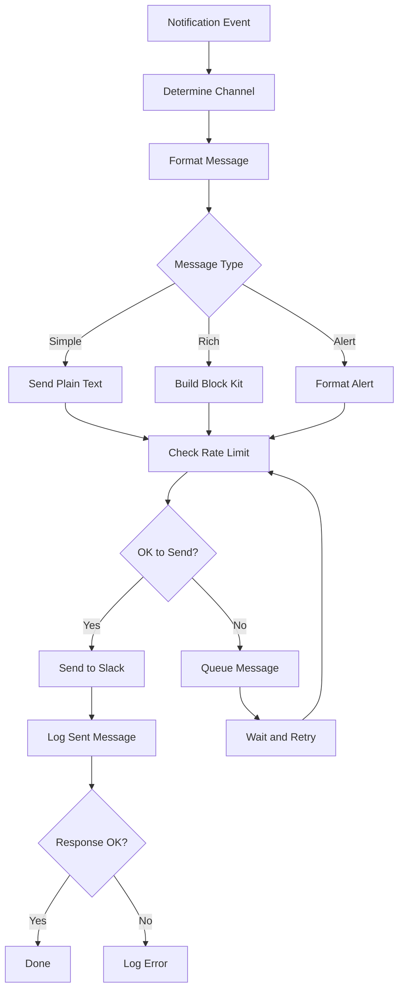

# Workflow

```mermaid
flowchart TD
    A[Notification Event] --> B[Determine Channel]
    B --> C[Format Message]
    C --> D{Message Type}
    D -->|Simple| E[Send Plain Text]
    D -->|Rich| F[Build Block Kit]
    D -->|Alert| G[Format Alert]
    F --> H[Check Rate Limit]
    G --> H
    E --> H
    H --> I{OK to Send?}
    I -->|Yes| J[Send to Slack]
    I -->|No| K[Queue Message]
    K --> L[Wait and Retry]
    L --> H
    J --> M[Log Sent Message]
    M --> N{Response OK?}
    N -->|Yes| O[Done]
    N -->|No| P[Log Error]
```

## Message Flow
1. Event triggers notification need
2. Select target channel
3. Format message appropriately
4. Send with rate limit compliance
5. Log outcome
