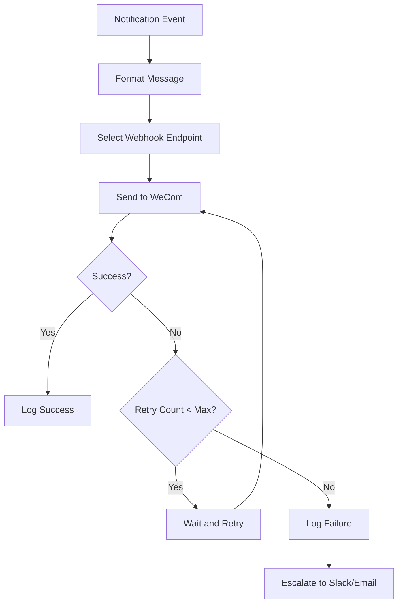

# Workflow

```mermaid
flowchart TD
    A[Notification Event] --> B[Format Message]
    B --> C[Select Webhook Endpoint]
    C --> D[Send to WeCom]
    D --> E{Success?}
    E -->|Yes| F[Log Success]
    E -->|No| G{Retry Count < Max?}
    G -->|Yes| H[Wait and Retry]
    H --> D
    G -->|No| I[Log Failure]
    I --> J[Escalate to Slack/Email]
```

## Message Flow
1. Event triggers notification
2. Format as markdown or text
3. Send via webhook with retry logic
4. Log outcome
