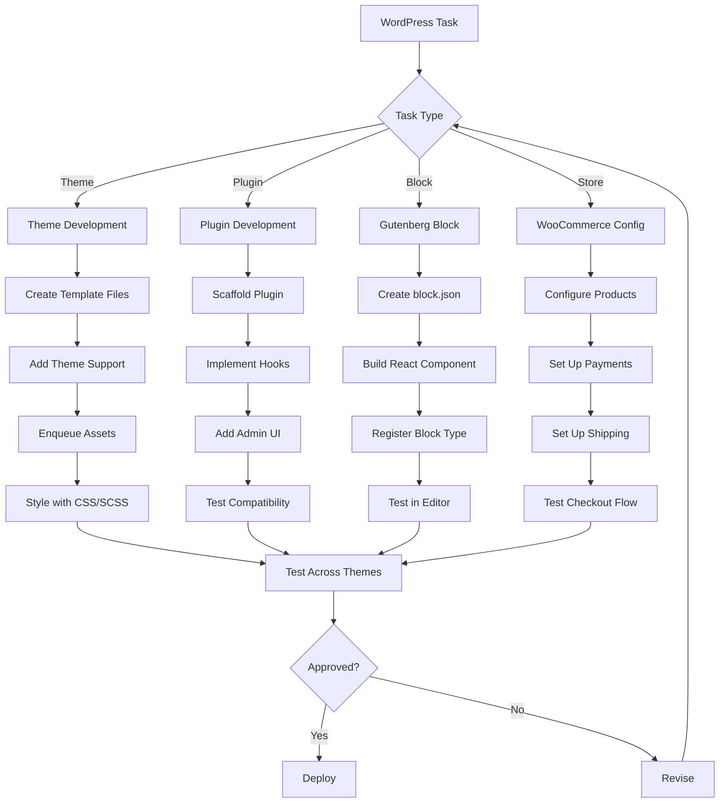

# Workflow

## Development Phases
1. Scaffolding: create theme/plugin structure
2. Implementation: build features
3. Testing: compatibility, security, performance
4. Deployment: upload/activate/go-live
