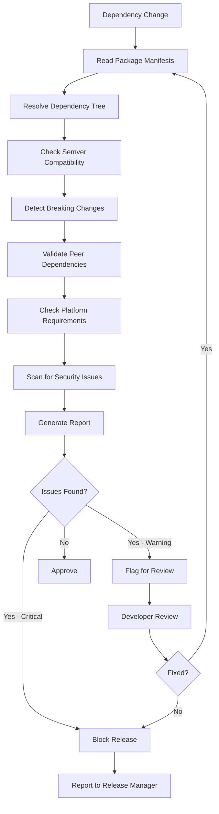

# Workflow

## Key Checks
- Peer dependency satisfaction
- Breaking change presence (major bumps)
- Transitive dependency conflicts
- Engine/platform version requirements
- Known vulnerability scan
