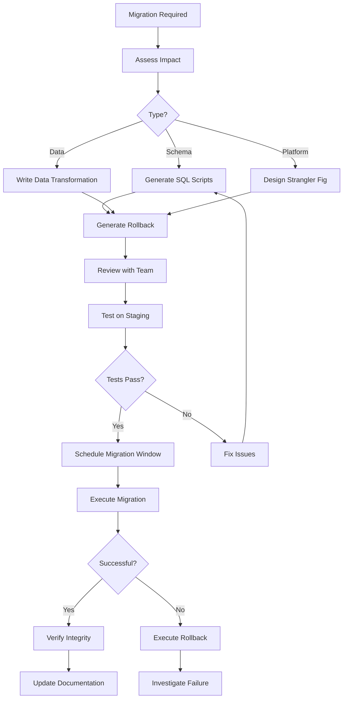

# Workflow

## Phases
1. **Assessment**: Impact analysis, risk evaluation, dependency check
2. **Scripting**: Generate migration and rollback scripts
3. **Validation**: Test on staging, verify integrity
4. **Execution**: Run during scheduled window with monitoring
5. **Verification**: Post-migration data integrity checks
