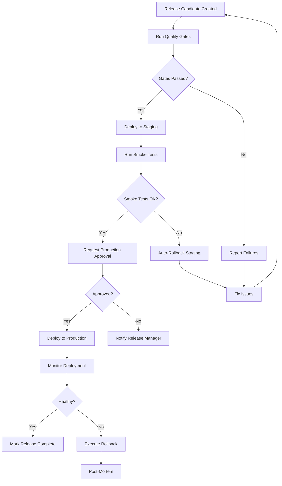

# Workflow

## Steps
1. **Quality Gates**: Run all tests, lint, typecheck, security scan
2. **Staging Deploy**: Deploy to staging environment
3. **Smoke Tests**: Run critical path tests
4. **Production Approval**: Request and wait for approval
5. **Production Deploy**: Gradual rollout with monitoring
6. **Post-Deploy**: Verify health, tag release, generate notes
