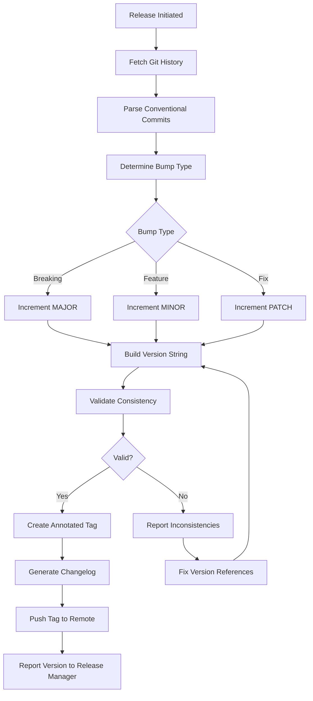

# Workflow

## Phases
1. **History Analysis**: Read commits since last tag
2. **Bump Calculation**: Determine MAJOR/MINOR/PATCH
3. **Validation**: Check version consistency across files
4. **Tagging**: Create and push annotated tag
5. **Changelog**: Generate release notes from commits
