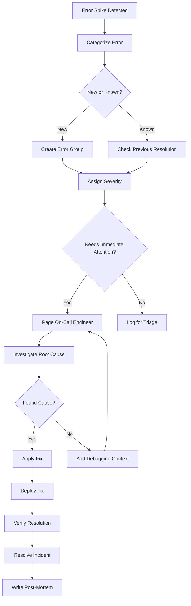

# Workflow

## Response Phases
1. **Detection**: Alert received or error spike identified
2. **Triage**: Assign severity and responder
3. **Investigation**: Root cause analysis
4. **Remediation**: Fix or mitigation deployment
5. **Post-Mortem**: Document what happened and preventative measures
