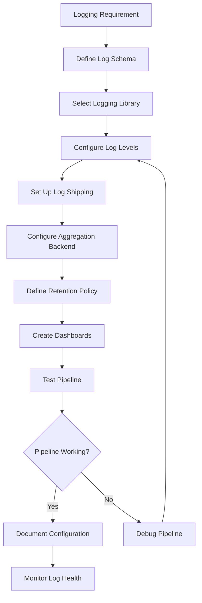

# Workflow

## Implementation Steps
1. Schema design with required fields
2. Library configuration (Winston/Pino/log4j)
3. Shipping pipeline setup (Vector/Fluentd)
4. Backend configuration (Loki/Elasticsearch)
5. Dashboard creation (Grafana/Kibana)
6. Testing and validation
