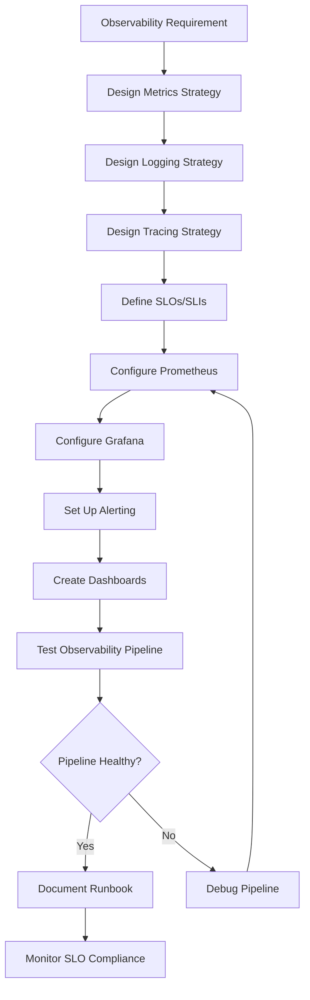

# Workflow

## Implementation Phases
1. **Strategy Design**: Metrics, logging, and tracing approach
2. **Infrastructure Setup**: Prometheus, Loki, Tempo, Grafana
3. **Instrumentation**: Application-level observability
4. **Alerting**: Rules, escalation, notification channels
5. **Dashboards**: Service and business views
6. **Validation**: End-to-end pipeline testing
