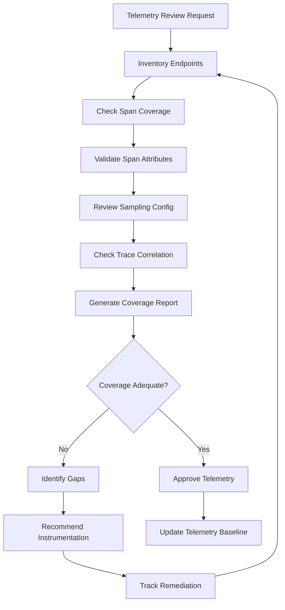

# Workflow

## Review Phases
1. **Inventory**: List all service endpoints and operations
2. **Coverage Check**: Which operations have spans
3. **Quality Check**: Validate attribute completeness
4. **Sampling Review**: Appropriate sampling for traffic
5. **Correlation**: Logs and metrics linked to traces
6. **Report**: Generate coverage scorecard
