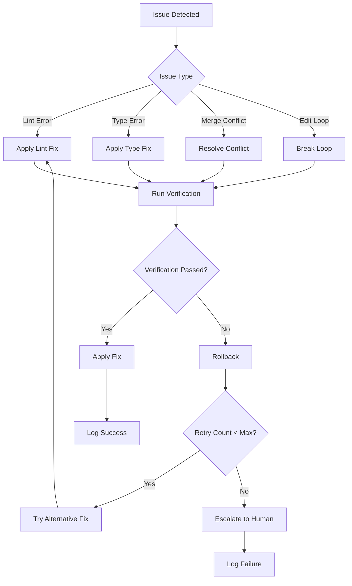

# Workflow

```mermaid
flowchart TD
    A[Issue Detected] --> B{Issue Type}
    B -->|Lint Error| C[Apply Lint Fix]
    B -->|Type Error| D[Apply Type Fix]
    B -->|Merge Conflict| E[Resolve Conflict]
    B -->|Edit Loop| F[Break Loop]
    C --> G[Run Verification]
    D --> G
    E --> G
    F --> G
    G --> H{Verification Passed?}
    H -->|Yes| I[Apply Fix]
    H -->|No| J[Rollback]
    J --> K{Retry Count < Max?}
    K -->|Yes| L[Try Alternative Fix]
    L --> C
    K -->|No| M[Escalate to Human]
    I --> N[Log Success]
    M --> O[Log Failure]
```

## Fix Analysis
1. Understand the error context
2. Generate targeted fix
3. Test fix in isolation
4. Apply and verify
5. Report outcome
