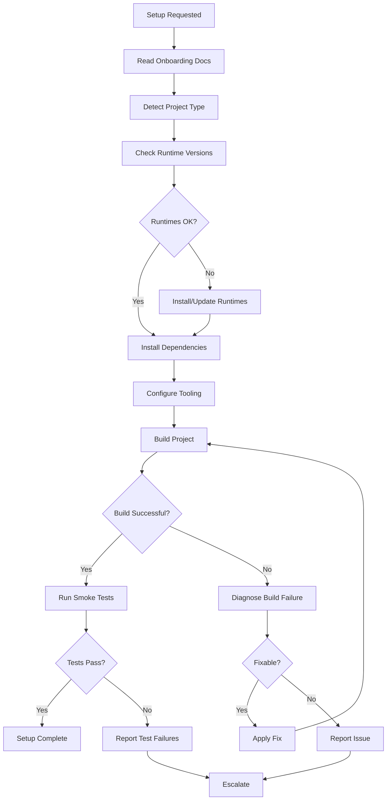

# Workflow

## Phases
1. **Discovery**: Read docs, detect project type
2. **Environment Check**: Runtime versions, required tools
3. **Installation**: Dependencies, build tools
4. **Verification**: Build, smoke tests
5. **Reporting**: Success or failure with diagnostics
