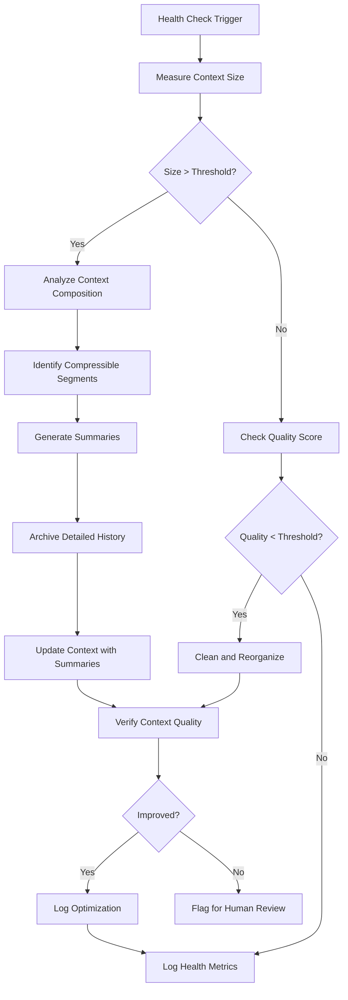

# Workflow

## Context Lifecycle
1. **Active**: Current task context (high detail)
2. **Summarized**: Recent completed tasks (bullet points)
3. **Archived**: Older history (reference only)
4. **Cleaned**: Removed irrelevant or superseded content
