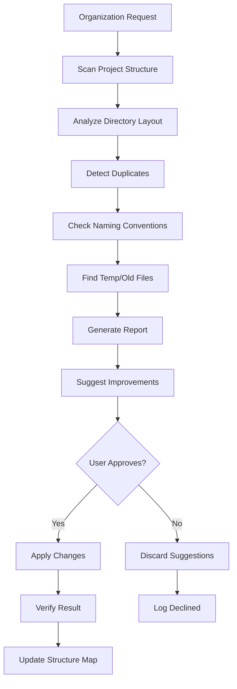

# Workflow

```mermaid
flowchart TD
    A[Organization Request] --> B[Scan Project Structure]
    B --> C[Analyze Directory Layout]
    C --> D[Detect Duplicates]
    D --> E[Check Naming Conventions]
    E --> F[Find Temp/Old Files]
    F --> G[Generate Report]
    G --> H[Suggest Improvements]
    H --> I{User Approves?}
    I -->|Yes| J[Apply Changes]
    I -->|No| K[Discard Suggestions]
    J --> L[Verify Result]
    L --> M[Update Structure Map]
    K --> N[Log Declined]
```

## Safety Measures
1. Always dry-run first (default)
2. Preview all changes before applying
3. Backup before restructuring
4. Never delete files without explicit confirmation
