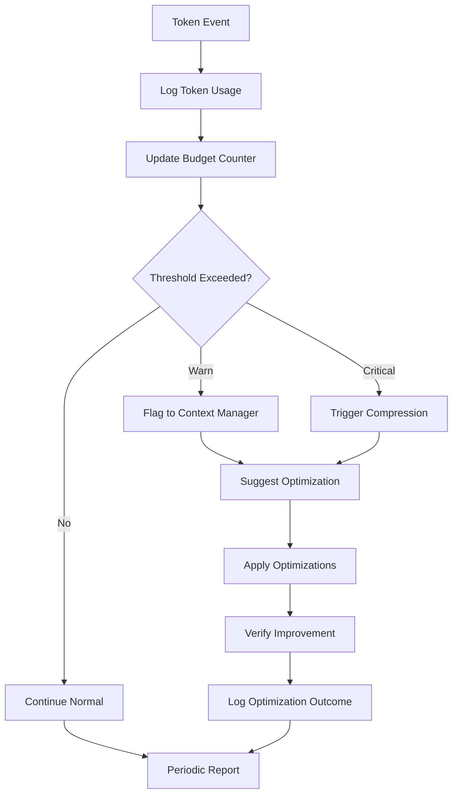

# Workflow

```mermaid
flowchart TD
    A[Token Event] --> B[Log Token Usage]
    B --> C[Update Budget Counter]
    C --> D{Threshold Exceeded?}
    D -->|Warn| E[Flag to Context Manager]
    D -->|Critical| F[Trigger Compression]
    D -->|No| G[Continue Normal]
    E --> H[Suggest Optimization]
    F --> H
    H --> I[Apply Optimizations]
    I --> J[Verify Improvement]
    J --> K[Log Optimization Outcome]
    G --> L[Periodic Report]
    K --> L
```

## Optimization Loops
1. **Proactive**: Track usage and warn before limits
2. **Reactive**: Respond to threshold breaches
3. **Analytical**: Post-session efficiency review
