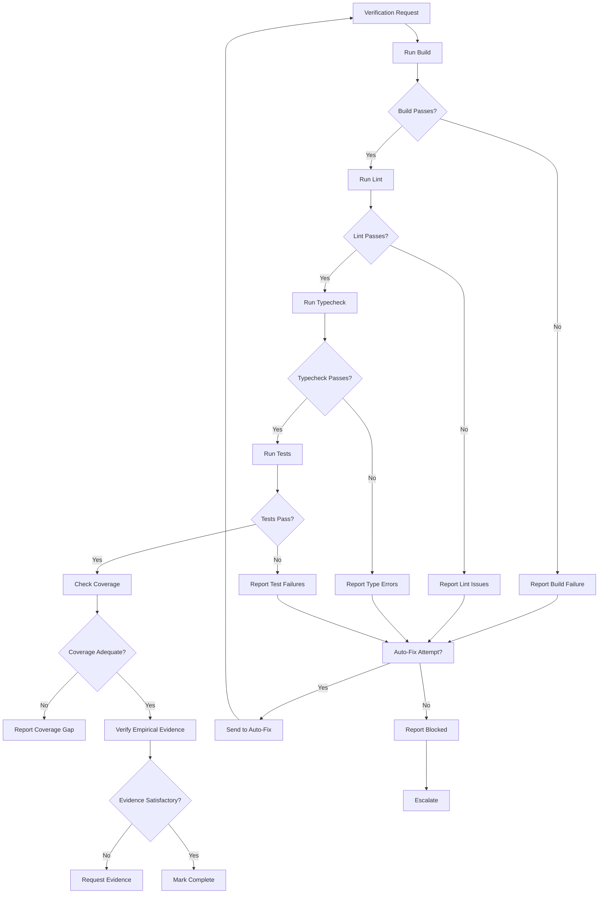

# Workflow

```mermaid
flowchart TD
    A[Verification Request] --> B[Run Build]
    B --> C{Build Passes?}
    C -->|No| D[Report Build Failure]
    C -->|Yes| E[Run Lint]
    E --> F{Lint Passes?}
    F -->|No| G[Report Lint Issues]
    F -->|Yes| H[Run Typecheck]
    H --> I{Typecheck Passes?}
    I -->|No| J[Report Type Errors]
    I -->|Yes| K[Run Tests]
    K --> L{Tests Pass?}
    L -->|No| M[Report Test Failures]
    L -->|Yes| N[Check Coverage]
    N --> O{Coverage Adequate?}
    O -->|No| P[Report Coverage Gap]
    O -->|Yes| Q[Verify Empirical Evidence]
    Q --> R{Evidence Satisfactory?}
    R -->|No| S[Request Evidence]
    R -->|Yes| T[Mark Complete]
    D --> U[Auto-Fix Attempt?]
    G --> U
    J --> U
    M --> U
    U -->|Yes| V[Send to Auto-Fix]
    U -->|No| W[Report Blocked]
    V --> A
    W --> X[Escalate]
```

## Gates (in order)
1. Build
2. Lint
3. Typecheck
4. Tests
5. Coverage
6. Empirical Evidence
