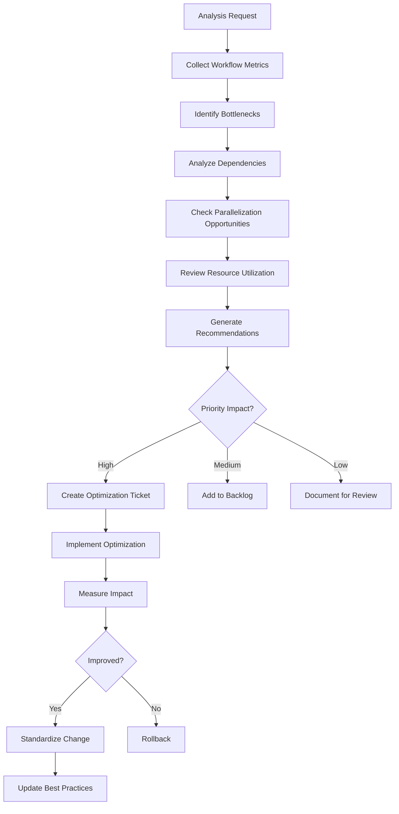

# Workflow

## Analysis Dimensions
1. **Speed**: Duration of each stage
2. **Reliability**: Failure rate per stage
3. **Resource Usage**: CPU, memory, network
4. **Cost**: Runner minutes, storage
5. **Wait Time**: Queue and dependency delays
