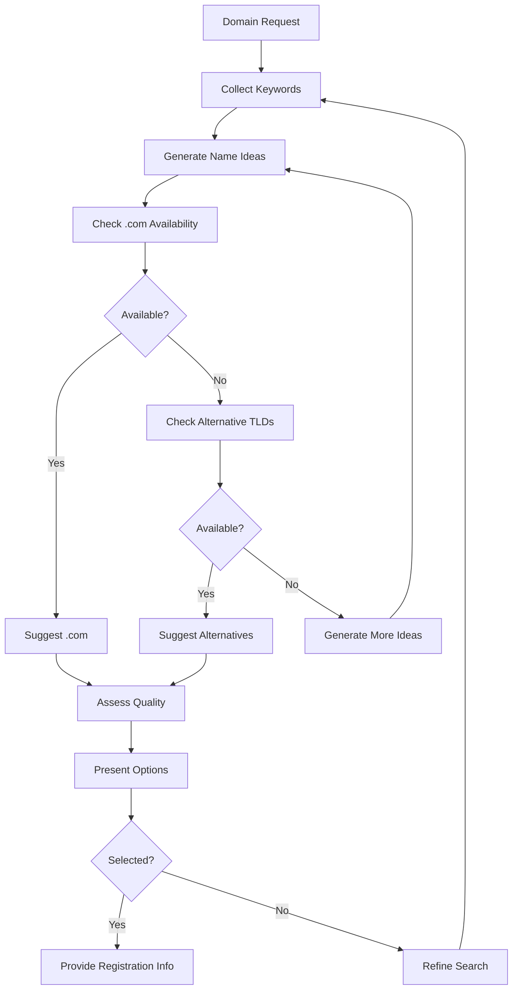

# Workflow

```mermaid
flowchart TD
    A[Domain Request] --> B[Collect Keywords]
    B --> C[Generate Name Ideas]
    C --> D[Check .com Availability]
    D --> E{Available?}
    E -->|Yes| F[Suggest .com]
    E -->|No| G[Check Alternative TLDs]
    G --> H{Available?}
    H -->|Yes| I[Suggest Alternatives]
    H -->|No| J[Generate More Ideas]
    J --> C
    F --> K[Assess Quality]
    I --> K
    K --> L[Present Options]
    L --> M{Selected?}
    M -->|Yes| N[Provide Registration Info]
    M -->|No| O[Refine Search]
    O --> B
```

## Process
1. Brainstorm: generate name candidates
2. Check: verify availability on TLDs
3. Qualify: assess memorability and brand fit
4. Recommend: present best options with rationale
