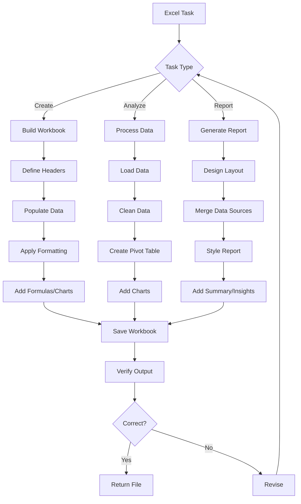

# Workflow

```mermaid
flowchart TD
    A[Excel Task] --> B{Task Type}
    B -->|Create| C[Build Workbook]
    B -->|Analyze| D[Process Data]
    B -->|Report| E[Generate Report]
    C --> F[Define Headers]
    F --> G[Populate Data]
    G --> H[Apply Formatting]
    H --> I[Add Formulas/Charts]
    D --> J[Load Data]
    J --> K[Clean Data]
    K --> L[Create Pivot Table]
    L --> M[Add Charts]
    E --> N[Design Layout]
    N --> O[Merge Data Sources]
    O --> P[Style Report]
    P --> Q[Add Summary/Insights]
    I --> R[Save Workbook]
    M --> R
    Q --> R
    R --> S[Verify Output]
    S --> T{Correct?}
    T -->|Yes| U[Return File]
    T -->|No| V[Revise]
    V --> B
```

## Process
1. Planning: structure, formulas, visualization
2. Building: data population, formatting
3. Analysis: pivot tables, statistics
4. Finalization: review, save, export
