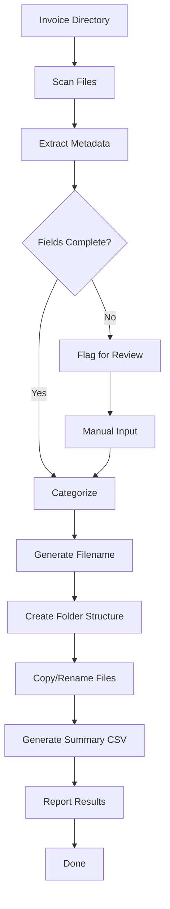

# Workflow

## Steps
1. Scan input directory
2. Extract invoice data (vendor, date, amount)
3. Categorize each invoice
4. Rename files consistently
5. Sort into date-based folders
6. Generate summary report
