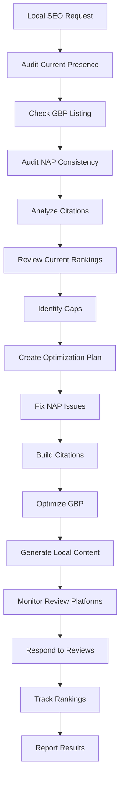

# Workflow

## Phases
1. **Audit**: assess current local SEO state
2. **Plan**: prioritize optimization actions
3. **Execute**: fix issues, build citations
4. **Monitor**: track rankings and reviews
5. **Report**: show improvement metrics
