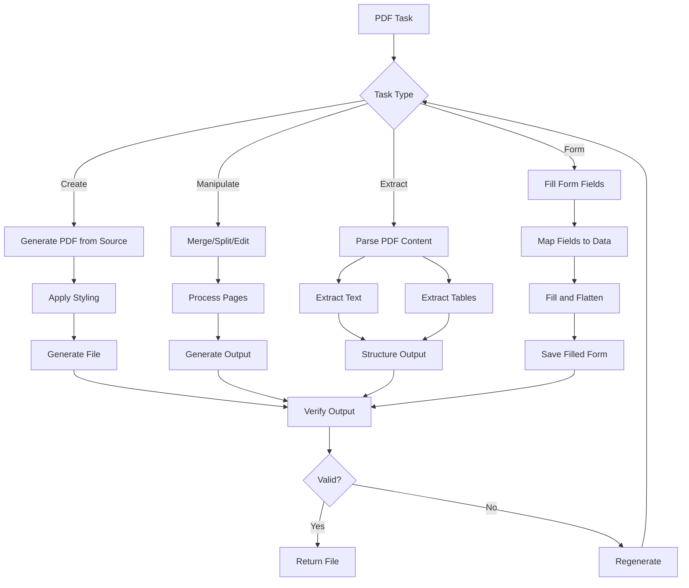

# Workflow

```mermaid
flowchart TD
    A[PDF Task] --> B{Task Type}
    B -->|Create| C[Generate PDF from Source]
    B -->|Extract| D[Parse PDF Content]
    B -->|Manipulate| E[Merge/Split/Edit]
    B -->|Form| F[Fill Form Fields]
    C --> G[Apply Styling]
    G --> H[Generate File]
    D --> I[Extract Text]
    D --> J[Extract Tables]
    I --> K[Structure Output]
    J --> K
    E --> L[Process Pages]
    L --> M[Generate Output]
    F --> N[Map Fields to Data]
    N --> O[Fill and Flatten]
    O --> P[Save Filled Form]
    H --> Q[Verify Output]
    M --> Q
    K --> Q
    P --> Q
    Q --> R{Valid?}
    R -->|Yes| S[Return File]
    R -->|No| T[Regenerate]
    T --> B
```

## Process
1. Source handling: read/create source content
2. Processing: apply transformations
3. Output: generate resulting PDF
4. Verification: validate output
