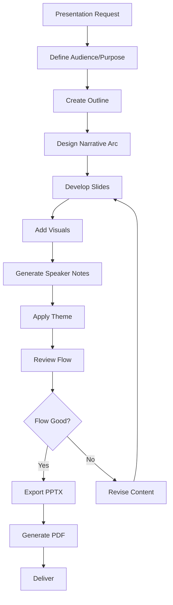

# Workflow

## Structure Process
1. **Plan**: audience analysis, key message, structure
2. **Outline**: content hierarchy, slide sequence
3. **Create**: write content, design slides
4. **Polish**: apply theme, review consistency
5. **Export**: generate PPTX and PDF files
