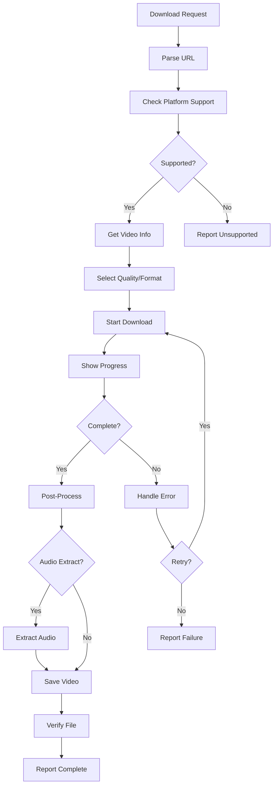

# Workflow

## Process
1. URL validation and platform detection
2. Video information retrieval
3. Quality/format selection
4. Download with progress tracking
5. Post-processing (conversion, extraction)
6. File verification
