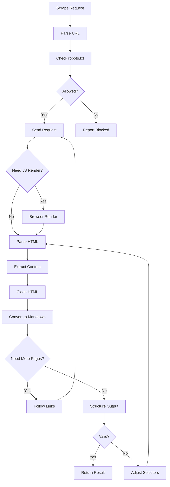

# Workflow

## Process
1. Validation: check URL, robots.txt
2. Request: fetch page content
3. Rendering: JS execution if needed
4. Extraction: parse and clean content
5. Conversion: HTML to markdown/structured data
6. Pagination: follow links if needed
